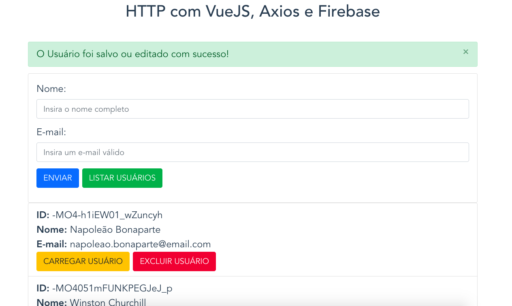

### HTTP with VueJS, Axios and Firebase - Udemy COD3R - More Concepts of the Vue.js HTTP Verbs:

<h2 align="center"> 
  Simple Project HTTP with VueJS - Udemy
</h2>

<p align="center">
  
</p>

<blockquote align="center">“Always evolving and learning more every day!”</blockquote>

### Application developed with Vue JS:

## Project setup
```
npm install
```

### Compiles and hot-reloads for development
```
npm run serve
```

### Compiles and minifies for production
```
npm run build
```

### Run your tests
```
npm run test
```

### Lints and fixes files
```
npm run lint
```

### Customize configuration
See [Configuration Reference](https://cli.vuejs.org/config/).

### Know more about me!

  https://www.linkedin.com/in/alexgomesnet/

### License:

  [MIT](LICENSE)
